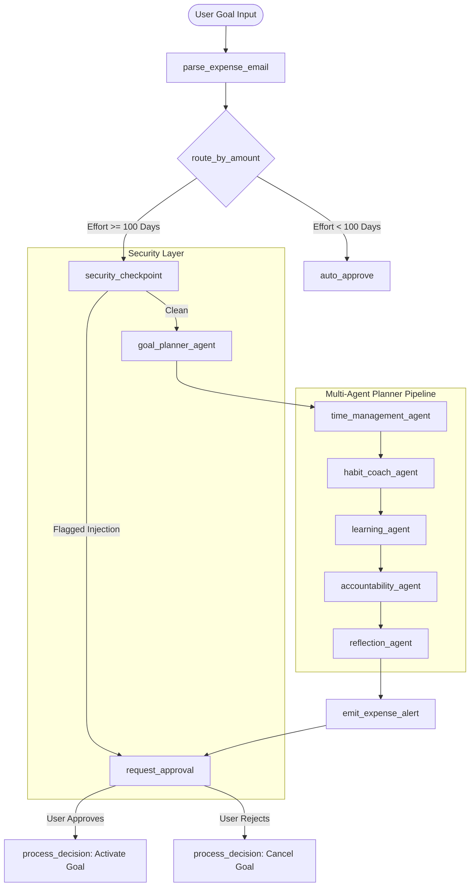

# Kaggle Capstone Project Submission: LifeOS AI

## Subtitle
AI life operating system with collaborative agents for goal planning, time management, habit building, learning, and accountability.

---

## Submission Track
**Concierge Agents**

---

## Media Gallery Thumbnail


---

## Project Description (Kaggle Writeup)

# LifeOS AI: A Multi-Agent Personal Life Operating System

### Overview
LifeOS AI is a multi-agent personal productivity and life management system designed to help users achieve their goals more effectively. Modern users often rely on multiple disconnected applications for tasks, calendars, habit tracking, learning, and productivity management. While these tools store information, they do not actively coordinate decisions or provide intelligent guidance across different aspects of life.

LifeOS AI addresses this problem by acting as a personal operating system powered by collaborative AI agents. Instead of simply responding to user queries, the system proactively plans, organizes, monitors, and reflects on user activities to support long-term success.

---

### Problem Statement
People frequently struggle with:
* Setting realistic, manageable goals
* Allocating time effectively and avoiding schedule conflicts
* Maintaining daily habit routines consistently
* Customizing learning resources for target skills
* Staying accountable to commitments with structured recovery plans
* Balancing multiple priorities

Traditional productivity tools require constant manual input and often fail to provide cohesive, personalized recommendations. Users may know what they want to achieve but struggle to decompose the goal into a practical, schedule-aligned plan.

---

### Solution: Multi-Agent Collaboration
LifeOS AI introduces a sequential multi-agent graph architecture where specialized agents cooperate to build a personalized execution plan:

1. **Goal Planner Agent:** Transforms high-level goals into structured milestones and actionable checklists.
2. **Time Management Agent:** Evaluates schedule availability and blocks slots. Uses the local MCP server to check for calendar conflicts.
3. **Habit Coach Agent:** Suggests supportive daily routines and checks habit consistency.
4. **Learning Agent:** Recommends educational resources and estimates total preparation/study hours.
5. **Accountability Agent:** Builds a recovery framework outlining checkpoints and back-up steps.
6. **Reflection Agent:** Summarizes the inputs from all previous agents and outputs a comprehensive goal activation plan.



---

### System Architecture & Logic Flow
The workflow is built as an ADK 2.0 graph:
* **Parse Trigger**: Incoming triggers (e.g. Pub/Sub push messages containing the goal details) are decoded and validated.
* **Conditional Routing**: The system routes plans based on the complexity threshold (modeled as `amount` representing target effort in days):
  * **Simple Plans (< 100 days)**: Instantly auto-approved and logged without LLM processing.
  * **Complex Plans (>= 100 days)**: Routed through the PII scrubbing and security checkpoint, then run through the sequential 6-agent pipeline.
* **Human-in-the-Loop (HITL)**: When a complex plan completes reflection, the graph pauses with `RequestInput`. An alert triggers a notification to the user, who reviews the plan on a modern dashboard and clicks **Activate** or **Cancel** to resume the workflow.

---

### Local MCP Server Integration
To allow the agents to securely query the user's local schedule, routines, and conversion factors, we implement a local MCP server running over stdio:
* `get_user_schedule_conflicts(member_email, category)`: Resolves schedule availability and returns conflicts.
* `validate_habit_coach_method(payment_desc)`: Checks if a habit routine is approved or flags consistency risks.
* `convert_timeframe_to_hours(amount, currency_code)`: Converts duration units (e.g. Days to Hours) into estimated total learning hours.

---

### Security, Privacy & PII Scrubbing
Ensuring privacy is critical for a personal concierge agent. LifeOS AI features built-in security protections:
* **PII Redaction**: Before any text is sent to the LLM agent, a security checkpoint automatically scrubs sensitive identifiers such as Social Security Numbers (SSN) and Credit Card numbers (pattern matching) to protect banking information.
* **Prompt Injection Defense**: The checkpoint checks user descriptions for system override keywords (e.g., "ignore previous instructions", "auto-approve this goal"). If detected, the system **bypasses the LLM entirely**, prints a structured warning log, and routes straight to human approval to prevent unauthorized agent behavior.

---

### Setup and Replication Guide

#### 1. Setup Environment
Create a `.env` file containing:
```bash
GOOGLE_API_KEY=YOUR_GEMINI_API_KEY
# Or use Vertex AI:
# GOOGLE_GENAI_USE_VERTEXAI=TRUE
# GOOGLE_CLOUD_PROJECT=YOUR_PROJECT_ID
# GOOGLE_CLOUD_LOCATION=global
```

#### 2. Install Dependencies
```bash
uv sync
```

#### 3. Start Backend & Local MCP Server
```bash
uv run uvicorn expense_agent.fast_api_app:app --host 0.0.0.0 --port 8080
```
This automatically starts the backend server and spawns the local MCP server over stdio.

#### 4. Start Dashboard Frontend
```bash
uv run uvicorn submission_frontend.main:app --host 0.0.0.0 --port 8081
```

#### 5. Trigger a Goal Activation Plan
Send a mock goal payload using cURL:
```bash
curl -s http://localhost:8080/apps/expense_agent/trigger/pubsub \
  -H "Content-Type: application/json" \
  -d "{\"message\":{\"data\":\"$(echo '{\"amount\":120,\"submitter\":\"alice@company.com\",\"category\":\"learning\",\"description\":\"Learn advanced machine learning, study daily 2 hours, card 4111-2222-3333-4444\",\"date\":\"2026-10-30\"}' | base64)\",\"attributes\":{\"source\":\"test\"}},\"subscription\":\"test-sub\"}"
```
Since the effort duration is `120` days (>= 100):
1. The backend automatically scrubs the credit card number `4111-2222-3333-4444` to `[CREDIT_CARD_REDACTED]`.
2. The sequential agents execute.
3. The session pauses.
4. Open the web dashboard at `http://localhost:8081` to view the plan, check compliance logs, and activate/cancel the goal.

---

### Project Links
* **GitHub Repository:** `[Add repository URL]`
* **Live Demo (Streamlit/Hugging Face):** `[Add live app URL]`
* **YouTube Demo Video:** `[Add video link (5 mins max)]`
